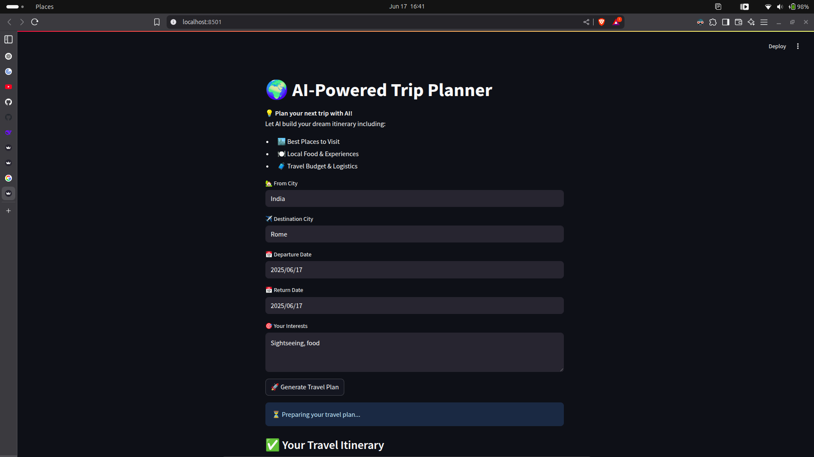
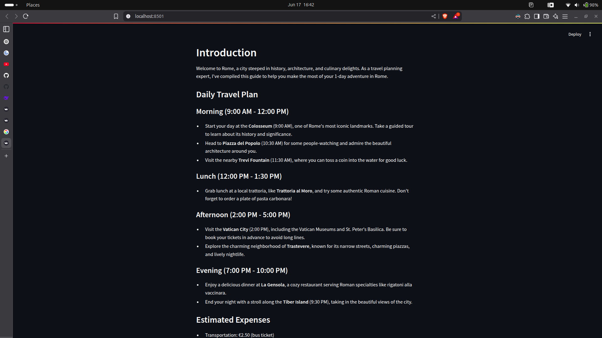

# 🧠 AI Agent Trip Planner 🧳

An intelligent, multi-agent travel assistant that helps users plan personalized trips using **RAG (Retrieval-Augmented Generation)**, **CrewAI**, **Streamlit**, and **Langchain**. The system uses local LLMs (like `ollama/llama3`) or OpenAI models to research, guide, and plan travel itineraries interactively.

---

## 🚀 Features

- 🗺️ **Location Expert**: Provides travel logistics, location details, and how to get there.
- 🧑‍🏫 **City Guide**: Shares hidden gems, attractions, and user-specific activity suggestions.
- 🧠 **Planner Expert**: Synthesizes information into a comprehensive travel itinerary.
- 🔍 **Web Search Tools**: Integrates DuckDuckGo-based search to fetch real-time data.
- 🧵 **RAG Pipeline**: Context-aware trip planning using relevant web-scraped content.
- 🖼️ **Streamlit Frontend**: Clean user interface for interacting with the planner.

---

## 🧱 Architecture


User Input

▼

[ Streamlit UI ]

│

▼

[ CrewAI Agents ]

├── Location Expert

├── City Guide

└── Planner Expert

│

▼

[ Tools (Search, Scrape) ]

│

▼

[ LLM (ollama/llama3 OR OpenAI GPT-4) ]

│

▼

[ Final Travel Plan Output ]

```

---

## 📁 File Structure

```

AI-Agent-Trip-Planner/

├── app.py                  # Streamlit app to run the planner

├── travelAgent.py          # Defines the LLM-powered agents

├── travelTask.py           # Task logic for each agent

├── travelTools.py          # Tools: web search, scraping, etc.

├── README.md               # Project documentation

└── requirements.txt        # Dependencies

```
## 💻 How to Run

### 1️⃣ Clone the Repository
```bash
git clone https://github.com/yourusername/AI-Agent-Trip-Planner.git
cd AI-Agent-Trip-Planner
```

### 2️⃣ Set Up Environment

```bash
conda create -n trip_planner python=3.10 -y
conda activate trip_planner
pip install -r requirements.txt
```

### 3️⃣ Start Ollama Server (optional for llama3)

```bash
ollama run llama3
```

### 4️⃣ Run the App

```bash
streamlit run app.py
```

---

## 🔧 Configuration

* To switch between **local LLMs (ollama)** and  **OpenAI models** , modify the `LLM` section in `travelAgent.py`.

```python
# For Ollama (offline)
llm = LLM(model="ollama/llama3", base_url="http://localhost:11434")

# For OpenAI (online)
llm = ChatOpenAI(model="gpt-4o", temperature=0.3)
```

---

## ✅ TODO

* [ ] Add itinerary download/export to PDF
* [ ] Add budget estimation support
* [ ] Enable multi-day trip planning
* [ ] Use vector DB (Chroma) for real RAG

---

# Output





## 🤖 Tech Stack

* [LangChain](https://www.langchain.com/)
* [CrewAI](https://docs.crewai.com/)
* [Streamlit](https://streamlit.io/)
* [Ollama](https://ollama.com/)
* [LiteLLM](https://github.com/BerriAI/litellm)
* [DuckDuckGoSearch](https://pypi.org/project/langchain-community/)

---

## 📜 License

MIT License. Feel free to use, modify, and share!

---

## 🙋‍♂️ Contributing

Feel free to open issues or pull requests. Let's build the smartest travel agent together 🌍.

```

```
